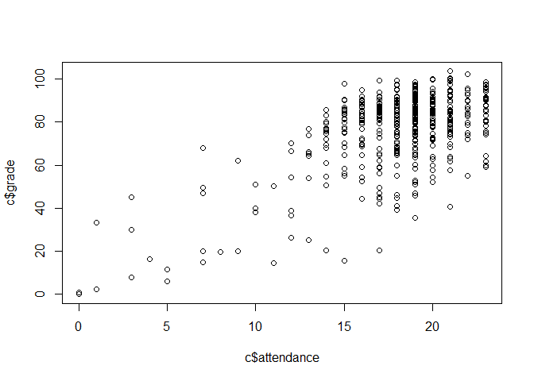

syllabus
================
Luke
2022-12-13

## R Markdown

## Week 1, January 15 : Something Interesting

``` r
c <- read.csv('attend-grade-relationships.csv')
str(c)
```

    ## 'data.frame':    481 obs. of  9 variables:
    ##  $ name      : int  8 65 89 139 225 266 287 289 328 338 ...
    ##  $ id        : int  278 378 76 406 442 129 460 309 435 328 ...
    ##  $ attendance: int  17 18 17 12 16 16 7 19 21 21 ...
    ##  $ max       : int  21 21 21 21 21 21 21 21 21 21 ...
    ##  $ grade     : num  76 67.4 42.3 36.7 79.8 79.7 68 82.6 94.4 97.5 ...
    ##  $ term      : int  1 1 1 1 1 1 1 1 1 1 ...
    ##  $ class     : int  2 2 2 2 2 2 2 2 2 2 ...
    ##  $ rgrade    : int  76 67 42 37 80 80 68 83 94 98 ...
    ##  $ perattend : num  81 85.7 81 57.1 76.2 ...

``` r
plot(c$attendance,c$grade)
```

<!-- -->
